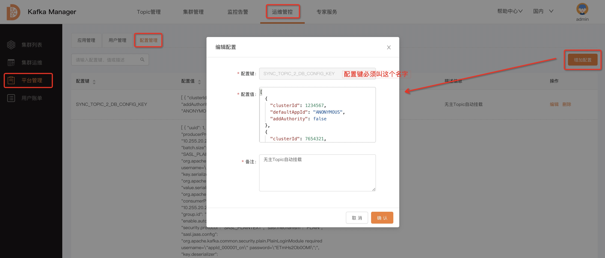

---


**一站式`Apache Kafka`集群指标监控与运维管控平台**

--- 

# 动态配置管理

## 0、目录

- 1、Topic定时同步任务
- 2、专家服务——Topic分区热点
- 3、专家服务——Topic分区不足
- 4、专家服务——Topic资源治理
- 5、账单配置


## 1、Topic定时同步任务

### 1.1、配置的用途
`Logi-KafkaManager`在设计上，所有的资源都是挂在应用(app)下面。 如果接入的Kafka集群已经存在Topic了，那么会导致这些Topic不属于任何的应用，从而导致很多管理上的不便。

因此，需要有一个方式将这些无主的Topic挂到某个应用下面。

这里提供了一个配置，会定时自动将集群无主的Topic挂到某个应用下面下面。

### 1.2、相关实现

就是一个定时任务，该任务会定期做同步的工作。具体代码的位置在`com.xiaojukeji.kafka.manager.task.dispatch.op`包下面的`SyncTopic2DB`类。

### 1.3、配置说明

**步骤一：开启该功能**

在application.yml文件中，增加如下配置，已经有该配置的话，直接把false修改为true即可
```yml
# 任务相关的开关
task:
  op:
    sync-topic-enabled: true # 无主的Topic定期同步到DB中
```

**步骤二：配置管理中指定挂在那个应用下面**

配置的位置：



配置键：`SYNC_TOPIC_2_DB_CONFIG_KEY`

配置值(JSON数组)：
- clusterId：需要进行定时同步的集群ID
- defaultAppId：该集群无主的Topic将挂在哪个应用下面
- addAuthority：是否需要加上权限, 默认是false。因为考虑到这个挂载只是临时的，我们不希望用户使用这个App，同时后续可能移交给真正的所属的应用，因此默认是不加上权限。

**注意，这里的集群ID，或者是应用ID不存在的话，会导致配置不生效。该任务对已经在DB中的Topic不会进行修改**
```json
[
  {
    "clusterId": 1234567, 
    "defaultAppId": "ANONYMOUS",
    "addAuthority": false
  },
  {
    "clusterId": 7654321,
    "defaultAppId": "ANONYMOUS",
    "addAuthority": false
  }
]
```

---

## 2、专家服务——Topic分区热点

在`Region`所圈定的Broker范围内，某个Topic的Leader数在这些圈定的Broker上分布不均衡时，我们认为该Topic是存在热点的Topic。

备注：单纯的查看Leader数的分布，确实存在一定的局限性，这块欢迎贡献更多的热点定义于代码。


Topic分区热点相关的动态配置(页面在运维管控->平台管理->配置管理)：

配置Key：
```
REGION_HOT_TOPIC_CONFIG
```

配置Value：
```json
{
  "maxDisPartitionNum": 2,  # Region内Broker间的leader数差距超过2时，则认为是存在热点的Topic
  "minTopicBytesInUnitB": 1048576,  # 流量低于该值的Topic不做统计
  "ignoreClusterIdList": [  # 忽略的集群
    50
  ]
}
```

---

## 3、专家服务——Topic分区不足

总流量除以分区数，超过指定值时，则我们认为存在Topic分区不足。

Topic分区不足相关的动态配置(页面在运维管控->平台管理->配置管理)：

配置Key：
```
TOPIC_INSUFFICIENT_PARTITION_CONFIG
```

配置Value：
```json
{
  "maxBytesInPerPartitionUnitB": 3145728,  # 单分区流量超过该值, 则认为分区不去
  "minTopicBytesInUnitB": 1048576,  # 流量低于该值的Topic不做统计
  "ignoreClusterIdList": [  # 忽略的集群
    50
  ]
}
```
## 4、专家服务——Topic资源治理

首先，我们认为在一定的时间长度内，Topic的分区offset没有任何变化的Topic，即没有数据写入的Topic，为过期的Topic。

Topic分区不足相关的动态配置(页面在运维管控->平台管理->配置管理)：

配置Key：
```
EXPIRED_TOPIC_CONFIG
```

配置Value：
```json
{
  "minExpiredDay": 30,  #过期时间大于此值才显示,
  "filterRegex": ".*XXX\\s+", #忽略符合此正则规则的Topic
  "ignoreClusterIdList": [  # 忽略的集群
    50
  ]
}
```

## 5、账单配置

Logi-KafkaManager除了作为Kafka运维管控平台之外，实际上还会有一些资源定价相关的功能。

当前定价方式：当月Topic的maxAvgDay天的峰值的均值流量作为Topic的使用额度。使用的额度 * 单价 * 溢价(预留buffer) 就等于当月的费用。
详细的计算逻辑见：com.xiaojukeji.kafka.manager.task.dispatch.biz.CalKafkaTopicBill; 和 com.xiaojukeji.kafka.manager.task.dispatch.biz.CalTopicStatistics;

这块在计算Topic的费用的配置如下所示：

配置Key：
```
KAFKA_TOPIC_BILL_CONFIG
```

配置Value：

```json
{ 
  "maxAvgDay": 10, # 使用额度的计算规则
  "quotaRatio": 1.5, # 溢价率
  "priseUnitMB": 100 # 单价，即单MB/s流量多少钱
}
```
